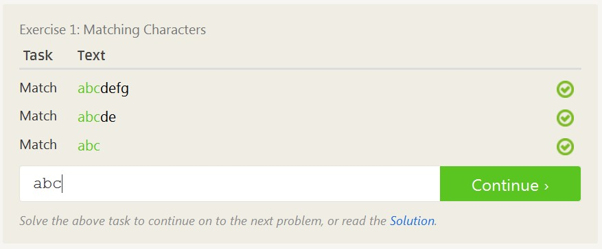
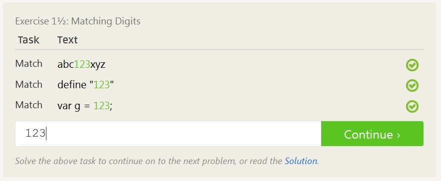
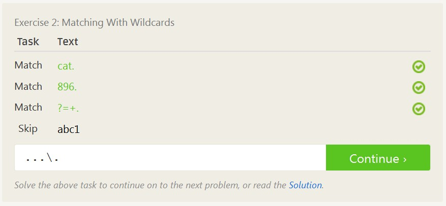
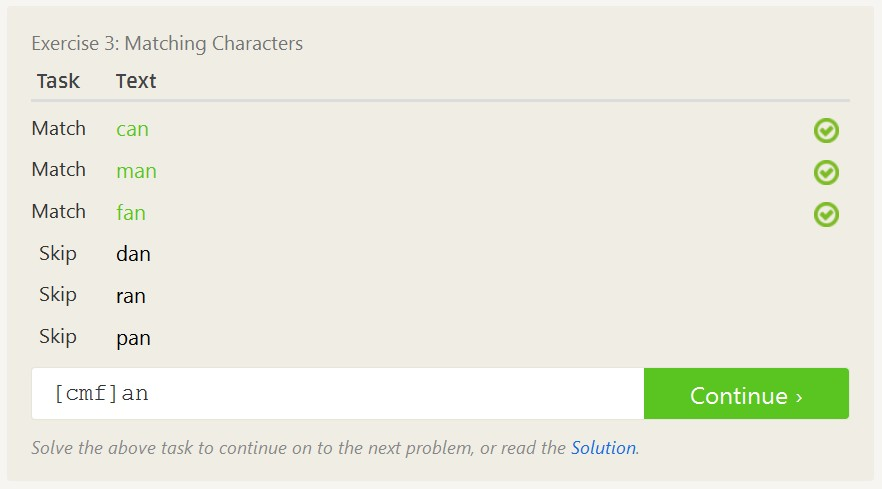
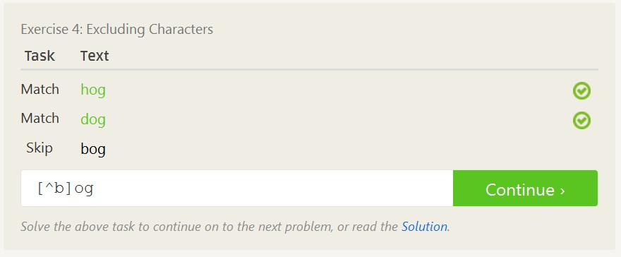
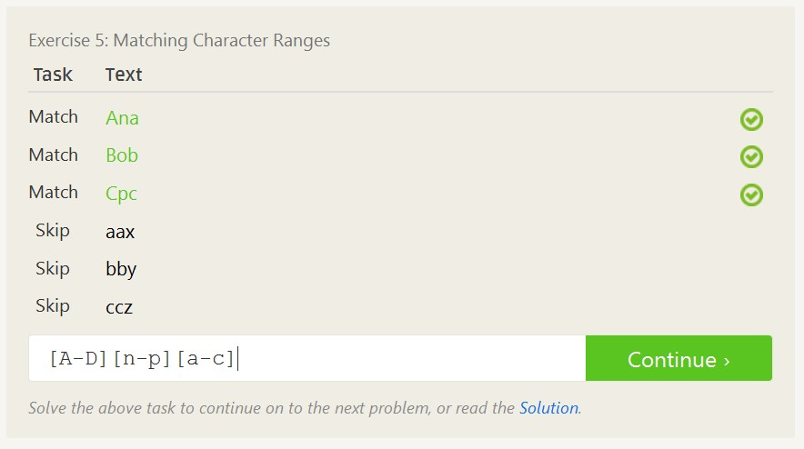
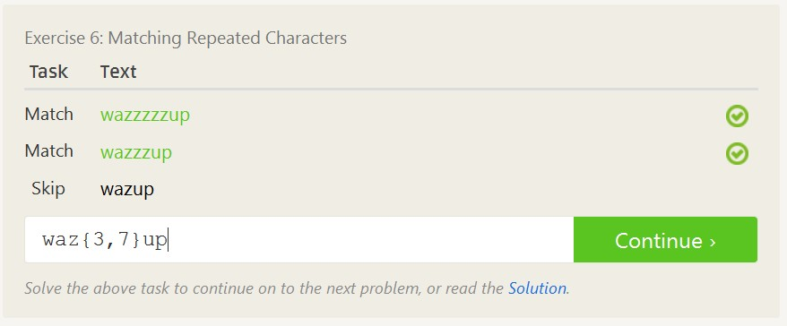
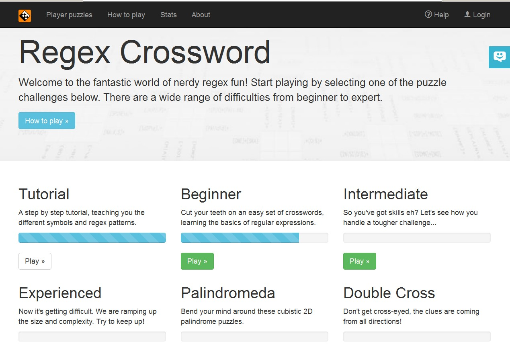
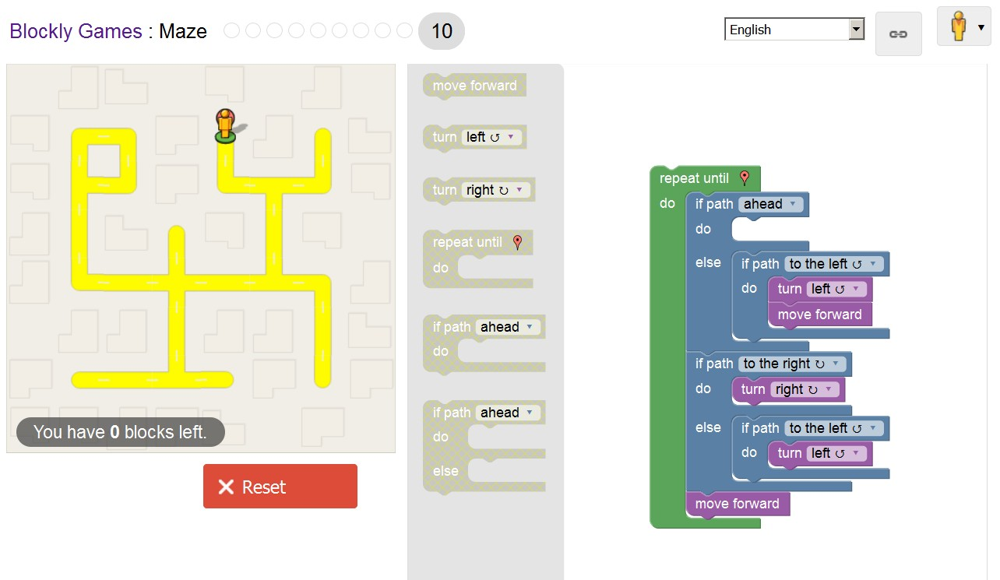

**Reading Assignments**

*10 Criteria of Open Source Definition:*
  - The source code needs to be free for everyone to use and add on to.
  - In general, there really can't be any restrictions on how open source
     software is used or shared

*Answering Questions in a Helpful Way:*
  - Depending on the user, start with the basics so you aren't looking for a higher level
     problem/solution when for instance the "Printer isn't plugged in"
  - Tell them what you would do if you were a user, to make them trust that what they are
     doing won't destroy their machine

*Free Culture:*
?????????????????????/

*Regex Practice:*

*Blocky:*

