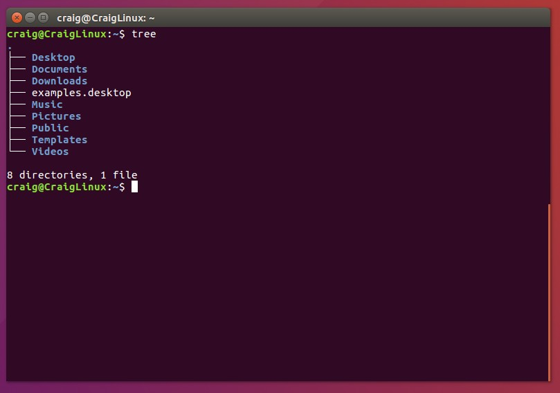

**Reading Assignments**

*10 Criteria of Open Source Definition:*
  - The source code needs to be free for everyone to use and add on to.
  - In general, there really can't be any restrictions on how open source
     software is used or shared

*Answering Questions in a Helpful Way:*
  - Depending on the user, start with the basics so you aren't looking for a higher level
     problem/solution when for instance the "Printer isn't plugged in"
  - Tell them what you would do if you were a user, to make them trust that what they are
     doing won't destroy their machine

*Free Culture:*

From the story about Jesse, there are many lessons to be learned.  First, be careful with what
programs you are writing.  An innocent personal program could get released into the wild without
you knowing it, and it could come back to haunt you.  Though in that day and age of the internet/intranet the
penalty from the RIAA seemed incredibly extreme and unwarranted.  If anything, I think there could
have been a hacking related investigation into his program, rather than a copyright infringement suit.  This
was also at a time when the RIAA was fighting Napster, so there may have been some other motives going on
in the background behind closed doors.  Regardless, even seemingly innocent programs to the user/owner, can
really be illegal and put you in legal jeopardy.  That is why it is really important with open-source
software to follow GNU and other regulations regarding open source.

*Tree:*

*Regex Practice:*

*Blocky:*

*Reflection:*

I actually have a couple projects that I'm interested in doing my open-source project for that have
the potential to benefit the entire RPI student body.  I don't really want to say them at this time
so I can keep the ideas for myself, until the time is right to share the idea.

In general, when I try to figure out what I want to code, I usually think about a repetative task that
would be really good to automate, so it involves less clicks of the mouse, to get what I want.  I then let it
sit in my head for a week or two, and come up with ideas of how I can best go about it.  And then when I have
a spare couple of hours, I'll just go ahead and code it all up.

