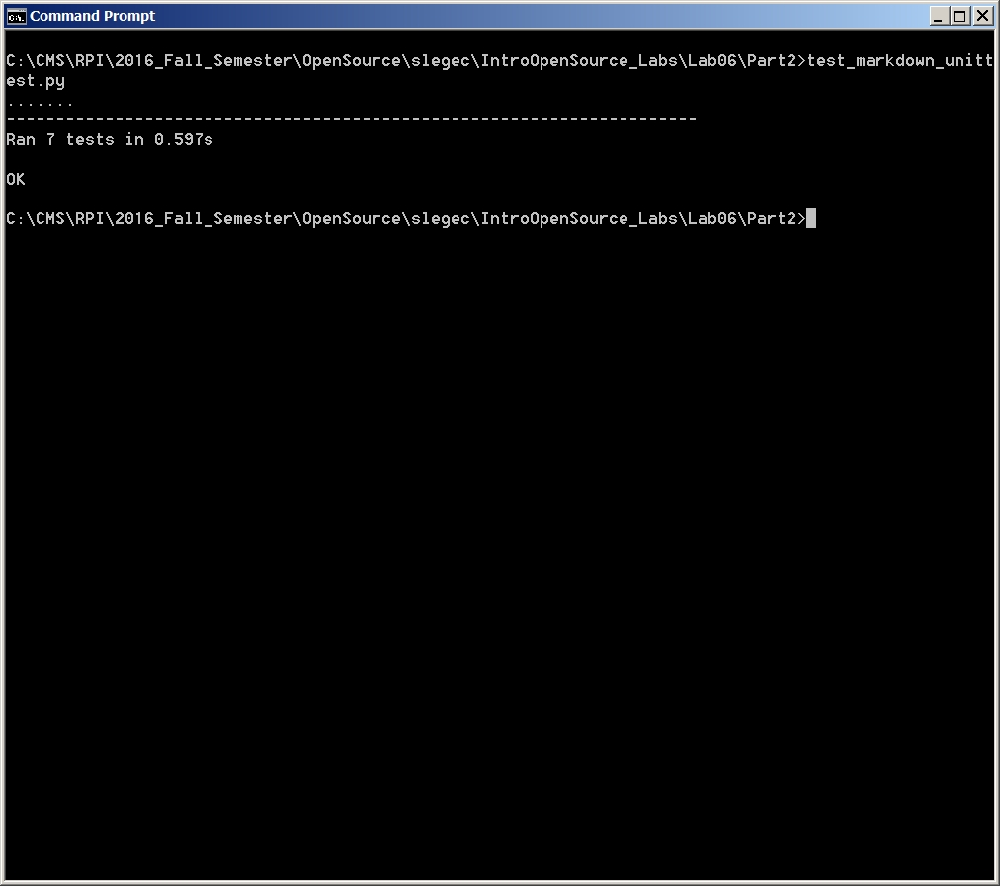

6.) Drops
* Number of Contributors: 2
* Number of Lines: 2223
* First commit: Nov. 5, 2015
* Latest commit: Oct. 2, 2016
* Master, node_demo
gitstats results:
* Lines of code: 1169
* Number of Contributors: 3

7.) EMPAC+
* Number of Contributors: 1
* Number of Lines: 2
* First commit: Sept. 13, 2016
* Latest commit: Sept. 13, 2016
* Master
gitstats results:
* Lines of code: 2
* Number of Contributors: 1

8.) Full Screen Pokemon
*NUMBER OF CONTRIBUTORS: 6
*NUMBER OF LINES OF CODE: 346,589
*FIRST COMMIT: 11/23/2014
*LATEST COMMIT: 10/10/2016
*CURRENT BRANCHES: Badges, Bugs, Crappy-Sounds, Cycling, Fishing, master, mods, moves, remotePreThing, special-moves,var-to-let
gitstats results:
* Lines of code: 56,544
* Number of Contributors: 8

9.) GLS
*NUMBER OF CONTRIBUTORS: 4
*NUMBER OF LINES OF CODE: 17,533
*FIRST COMMIT:  3/13/2016
*LATEST COMMIT: 10/12/2016
*CURRENT BRANCHES: master, math, simple-driving-object, travis-shenanigans
gitstats results:
* Lines of code: 17,630
* Number of Contributors: 5

10.) Grove
*NUMBER OF CONTRIBUTORS: 4
*NUMBER OF LINES OF CODE: 35,737
*FIRST COMMIT: 8/23/2015
*LATEST COMMIT: 10/4/2016
*CURRENT BRANCHES: UI, developement, engines-max, master
gitstats results:
* Lines of code: 13,697
* Number of Contributors: 5
Comments:
The numbers of projects and authors are different for all of the projects. All of the other information that was checked was the same

#Part 2

https://github.com/slegec/IntroOpenSource_Labs/blob/master/IntroOpenSource_Labs/Lab06/Part2/markdown.py

https://github.com/slegec/IntroOpenSource_Labs/blob/master/IntroOpenSource_Labs/Lab06/Part2/test_markdown_unittest.py
