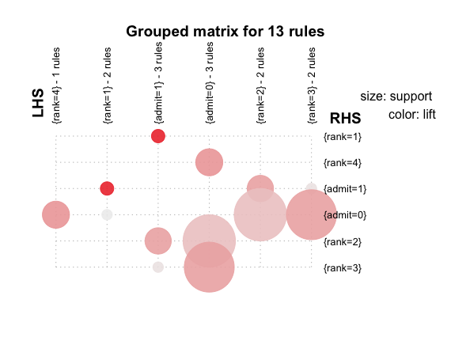
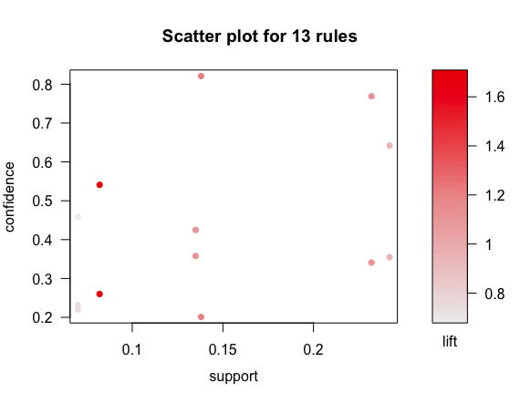
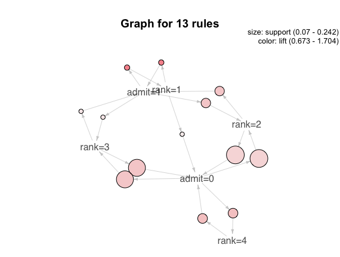
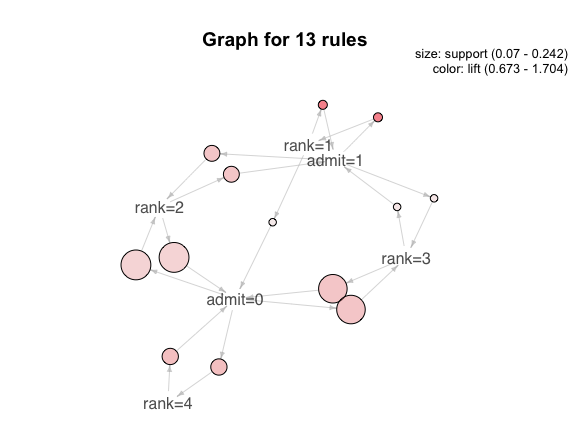

#Lab 08


```
> inspect(rules.sorted)
     lhs          rhs       support confidence lift
[1]  {rank=4}  => {admit=0} 0.138   0.821      1.203
[2]  {rank=3}  => {admit=0} 0.232   0.769      1.126
[3]  {rank=2}  => {admit=0} 0.242   0.642      0.941
[4]  {rank=1}  => {admit=1} 0.082   0.541      1.704
[5]  {rank=1}  => {admit=0} 0.070   0.459      0.673
[6]  {admit=1} => {rank=2}  0.135   0.425      1.126
[7]  {rank=2}  => {admit=1} 0.135   0.358      1.126
[8]  {admit=0} => {rank=2}  0.242   0.355      0.941
[9]  {admit=0} => {rank=3}  0.232   0.341      1.126
[10] {admit=1} => {rank=1}  0.082   0.260      1.704
[11] {rank=3}  => {admit=1} 0.070   0.231      0.729
[12] {admit=1} => {rank=3}  0.070   0.220      0.729
[13] {admit=0} => {rank=4}  0.138   0.201      1.203
```











Project Status:

For my project, I am currently able to download almost all files from one course
and store those files to their corresponding folder.  The next steps for me include implmenting
a recursive call to make sure I get all the files embedded in sub dirs on LMS.  In addition,
I need to make it so the files previously downloaded are tracked, and either not redownloaded, or are simply
overwritten.
