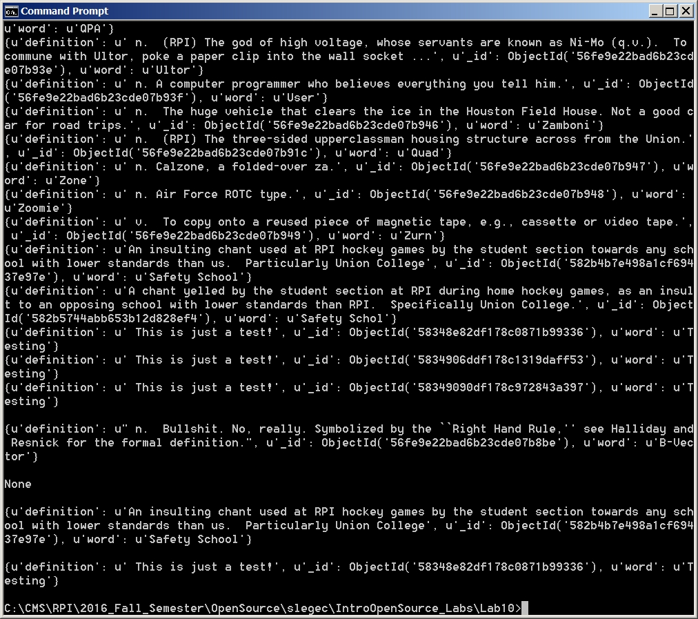

#Lab 10

## Checkpoint 3

*db.definitions.find()

Finds and prints all definitions in the file

*db.definitions.findOne()

Finds only one definition

*db.definitions.find({word: "Capitaland"}) # the content you provide in the { } is pattern matched to find your document

Finds all instances of the search term

*db.definitions.find({_id: ObjectId("56fe9e22bad6b23cde07b8ce")})

Finds the instance of the matching ObjectId

## Checkpoint 4

